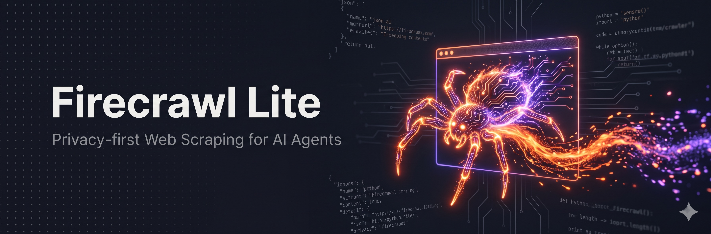

<div align="center">



# Firecrawl Lite MCP Server

**Privacy-first web scraping and data extraction for any MCP client — powered by local browser automation and your own LLM key.**

[](https://www.npmjs.com/package/@ariangibson/firecrawl-lite-mcp-server)
[](https://hub.docker.com/r/ariangibson/firecrawl-lite-mcp-server)
[](https://hub.docker.com/r/ariangibson/firecrawl-lite-mcp-server)
[](https://github.com/ariangibson/firecrawl-lite-mcp-server/actions/workflows/docker-build.yml)
[](https://github.com/ariangibson/firecrawl-lite-mcp-server/actions/workflows/test.yml)
[](https://nodejs.org)
[](https://modelcontextprotocol.io)
[](LICENSE)

</div>

---

Firecrawl Lite is a standalone [Model Context Protocol](https://modelcontextprotocol.io) server that gives any MCP client — Claude Desktop, Claude Code, Cursor, and others — the ability to scrape web pages and extract structured data. Pages are fetched and rendered with a local, stealth-enabled headless browser, and structured extraction is performed by **your own LLM provider**. There is no Firecrawl account and no third-party scraping service in the loop: the only API key you bring is the one for the LLM you already use.

## Contents

- [Why Firecrawl Lite](#why-firecrawl-lite)
- [Available Tools](#available-tools)
- [Quick Start](#quick-start)
- [Configuration](#configuration)
- [Remote Deployment](#remote-deployment)
- [Advanced Configuration](#advanced-configuration)
- [Usage Examples](#usage-examples)
- [Troubleshooting](#troubleshooting)
- [Container Images](#container-images)
- [Development](#development)
- [Credits](#credits)
- [License](#license)

## Why Firecrawl Lite

**Privacy-first.** Scraping and rendering happen on your own machine or server. Page content is only ever sent to the LLM provider you explicitly configure — nothing is routed through a third-party scraping cloud.

**Bring your own model.** Works with any OpenAI-compatible `chat/completions` endpoint: OpenAI, xAI (Grok), Anthropic, OpenRouter, Synthetic, or a local model via Ollama. You pay only for the LLM tokens you use.

**Lightweight and self-contained.** A single Node.js process with a bundled headless browser. Run it locally over stdio, or deploy it as one container behind HTTP/SSE. Multi-architecture images (`amd64` / `arm64`) are published on every release.

**Built for real scraping.** Stealth browser automation, rotating user agents, configurable delays, optional upstream proxies (including port-range rotation), and tunable retry/backoff.

## Available Tools

| Tool | Description | Required params | Optional params |
| --- | --- | --- | --- |
| `scrape_page` | Fetch and render a single page, returning clean text/markdown. | `url` | `onlyMainContent` |
| `batch_scrape` | Scrape multiple URLs in one request (up to 10). | `urls[]` | `onlyMainContent` |
| `extract_data` | Extract structured data from pages using a natural-language prompt and your LLM. | `urls[]`, `prompt` | `enableWebSearch` |
| `extract_with_schema` | Extract data conforming to a supplied JSON Schema. | `urls[]`, `schema` | `prompt`, `enableWebSearch` |
| `screenshot` | Capture a screenshot of a page via the stealth browser. | `url` | `width`, `height`, `fullPage` |

## Quick Start

The fastest way to use Firecrawl Lite locally is over stdio via `npx` — no install or container required. Add the LLM credentials for the provider of your choice (see [LLM provider examples](#llm-provider-examples)).

### Claude Desktop

Add to `~/Library/Application Support/Claude/claude_desktop_config.json` (macOS) or `%APPDATA%\Claude\claude_desktop_config.json` (Windows):

```json
{
  "mcpServers": {
    "firecrawl-lite": {
      "command": "npx",
      "args": ["-y", "@ariangibson/firecrawl-lite-mcp-server"],
      "env": {
        "LLM_API_KEY": "your_llm_api_key_here",
        "LLM_PROVIDER_BASE_URL": "https://api.openai.com/v1",
        "LLM_MODEL": "gpt-5.5"
      }
    }
  }
}
```

### Claude Code (CLI)

```bash
claude mcp add firecrawl-lite npx -- -y @ariangibson/firecrawl-lite-mcp-server \
  --env LLM_API_KEY=your_key \
  --env LLM_PROVIDER_BASE_URL=https://api.openai.com/v1 \
  --env LLM_MODEL=gpt-5.5
```

### Cursor

Add to your Cursor MCP configuration (`~/.cursor/mcp.json`):

```json
{
  "mcpServers": {
    "firecrawl-lite": {
      "command": "npx",
      "args": ["-y", "@ariangibson/firecrawl-lite-mcp-server"],
      "env": {
        "LLM_API_KEY": "your_llm_api_key_here",
        "LLM_PROVIDER_BASE_URL": "https://api.openai.com/v1",
        "LLM_MODEL": "gpt-5.5"
      }
    }
  }
}
```

## Configuration

All configuration is via environment variables. Only the three LLM variables are required; everything else has sensible defaults.

### Required

| Variable | Description |
| --- | --- |
| `LLM_API_KEY` | API key for your LLM provider. |
| `LLM_PROVIDER_BASE_URL` | Base URL of an OpenAI-compatible API (the server calls `{base_url}/chat/completions`). |
| `LLM_MODEL` | Model name to use for extraction. |

### Optional LLM tuning

These are passed straight through to the provider's `chat/completions` request. Leave any of them unset to use the default; the optional sampling parameters are omitted from the request entirely when unset.

| Variable | Default | Notes |
| --- | --- | --- |
| `LLM_TEMPERATURE` | `0.1` | Sampling temperature. |
| `LLM_MAX_TOKENS` | `2000` | Maximum tokens in the response. Raise this if extractions are being truncated. |
| `LLM_TOP_P` | _unset_ | Nucleus sampling; omitted from the request unless set. |
| `LLM_REASONING_EFFORT` | _unset_ | `reasoning_effort` for reasoning-capable models; omitted unless set. |

### LLM provider examples

```bash
# OpenAI
LLM_PROVIDER_BASE_URL=https://api.openai.com/v1
LLM_MODEL=gpt-5.5

# xAI (Grok)
LLM_PROVIDER_BASE_URL=https://api.x.ai/v1
LLM_MODEL=grok-4

# Anthropic
LLM_PROVIDER_BASE_URL=https://api.anthropic.com/v1
LLM_MODEL=claude-haiku-4-5

# OpenRouter
LLM_PROVIDER_BASE_URL=https://openrouter.ai/api/v1
LLM_MODEL=openai/gpt-5.5

# Local (Ollama)
LLM_PROVIDER_BASE_URL=http://localhost:11434/v1
LLM_MODEL=llama3.3
```

See [`.env.example`](.env.example) for the full, annotated list of variables.

## Remote Deployment

For remote or containerized use, enable at least one HTTP transport — **both are disabled by default** for security. Choose based on your client:

- `ENABLE_HTTP_STREAMABLE_ENDPOINT=true` → exposes `/mcp` (Claude Code, modern remote MCP clients).
- `ENABLE_SSE_ENDPOINT=true` → exposes `/sse` (Claude Desktop via `mcp-proxy`).

A `/health` endpoint is always available for health checks.

### Docker

```bash
docker run -d \
  -p 3000:3000 \
  -e ENABLE_HTTP_STREAMABLE_ENDPOINT=true \
  -e LLM_API_KEY=your_key_here \
  -e LLM_PROVIDER_BASE_URL=https://api.openai.com/v1 \
  -e LLM_MODEL=gpt-5.5 \
  ariangibson/firecrawl-lite-mcp-server:latest
```

### Docker Compose / Portainer / Swarm

A ready-to-use [`docker-compose.yml`](docker-compose.yml) is included. Set your variables in a `.env` file and deploy:

```bash
docker compose up -d
```

> **Note for Docker Swarm / Portainer:** the published image is `node:20-alpine`, which does **not** include `curl`. The bundled compose file uses a `wget`-based health check for this reason — see [Troubleshooting](#container-keeps-restarting-or-is-killed-with-sigterm) if you have customized it.

### Remote client configuration

**Claude Code (Streamable HTTP):**

```bash
claude mcp add firecrawl-lite-remote http://your-server:3000/mcp -t http
```

**Claude Desktop — Connectors (recommended, HTTPS only):**
Settings → Connectors → add `https://your-server.com:3000/mcp`. Requires a valid TLS certificate.

**Claude Desktop — `mcp-proxy` (HTTP fallback, no certificate):**

```bash
pip install mcp-proxy
```

```json
{
  "mcpServers": {
    "firecrawl-lite": {
      "command": "mcp-proxy",
      "args": ["http://your-server:3000/sse"]
    }
  }
}
```

## Advanced Configuration

### Proxy

Route the scraping browser through an upstream proxy. A port range (e.g. `:10001-10010`) enables automatic rotation across ports.

```bash
PROXY_SERVER_URL=http://proxy.example.com:10001-10010
PROXY_SERVER_USERNAME=your-username
PROXY_SERVER_PASSWORD=your-password
```

By default the proxy is used **only for scraping target sites** — LLM provider API calls go out directly. Routing your own LLM calls through a rotating (often residential) proxy is slower, can trip provider abuse detection, and may fail TLS. If you specifically need the LLM call proxied as well, opt in with:

```bash
PROXY_LLM_API=true
```

### Anti-detection and rate limiting

`SCRAPE_USER_AGENT` accepts either a single string or a JSON array of strings to rotate through. When using a JSON array, keep it on a single line.

```bash
SCRAPE_USER_AGENT=["Mozilla/5.0 (Macintosh; Intel Mac OS X 10_15_7) ... Safari/537.36","Mozilla/5.0 (Windows NT 10.0; Win64; x64) ... Safari/537.36"]
SCRAPE_VIEWPORT_WIDTH=1920
SCRAPE_VIEWPORT_HEIGHT=1080
SCRAPE_DELAY_MIN=1000          # min delay before navigation (ms)
SCRAPE_DELAY_MAX=3000          # max delay before navigation (ms)
SCRAPE_BATCH_DELAY_MIN=2000    # min delay between batch requests (ms)
SCRAPE_BATCH_DELAY_MAX=5000    # max delay between batch requests (ms)
```

### Retry and backoff

```bash
FIRECRAWL_RETRY_MAX_ATTEMPTS=3
FIRECRAWL_RETRY_INITIAL_DELAY=1000
FIRECRAWL_RETRY_MAX_DELAY=10000
FIRECRAWL_RETRY_BACKOFF_FACTOR=2
```

## Usage Examples

**Scrape a page**

```json
{ "name": "scrape_page", "arguments": { "url": "https://example.com" } }
```

**Batch scrape**

```json
{
  "name": "batch_scrape",
  "arguments": {
    "urls": ["https://example.com", "https://example.org"],
    "onlyMainContent": true
  }
}
```

**Extract with a prompt**

```json
{
  "name": "extract_data",
  "arguments": {
    "urls": ["https://example.com"],
    "prompt": "Extract the main article title and a one-sentence summary."
  }
}
```

**Extract with a JSON Schema**

```json
{
  "name": "extract_with_schema",
  "arguments": {
    "urls": ["https://example.com"],
    "schema": {
      "type": "object",
      "properties": {
        "title": { "type": "string" },
        "description": { "type": "string" }
      }
    }
  }
}
```

## Troubleshooting

### Chrome / Chromium issues

The local image bundles Chromium. For the `npx` install, Chrome is downloaded on first use. If it fails:

```bash
npx puppeteer browsers install chrome
# or reset a corrupted install
rm -rf ~/.cache/puppeteer && npx puppeteer browsers install chrome
```

### Extraction returns an error

`scrape_page` working but `extract_data` failing points to the LLM call rather than scraping. The server logs the upstream status, error code, and response body to stderr (`LLM extract_data request failed: ...`) and surfaces the HTTP status in the tool result. Common causes:

- **HTTP 401** — invalid `LLM_API_KEY`.
- **HTTP 400** — wrong `LLM_MODEL`, or a tuning parameter the model rejects (e.g. `LLM_MAX_TOKENS` above the model's limit, or `LLM_REASONING_EFFORT` on a non-reasoning model).
- **HTTP 429** — provider rate limit.

### Container keeps restarting or is killed with `SIGTERM`

If the logs show the server start (`listening on port 3000`) and then exit with `npm error signal SIGTERM`, the container is being killed by a **failing health check**, not by the app. The `node:20-alpine` image does not include `curl`, so a `curl`-based health check always fails and Swarm restarts the task in a loop. Use a `wget`-based check (busybox provides `wget`):

```yaml
healthcheck:
  test: ["CMD-SHELL", "wget --no-verbose --tries=1 --spider http://localhost:3000/health || exit 1"]
  interval: 30s
  timeout: 10s
  retries: 3
  start_period: 40s
```

The bundled `docker-compose.yml` already uses this form.

## Container Images

Pre-built, multi-architecture (`amd64`, `arm64`) images are published automatically on every push to `main` and on release:

- **Docker Hub:** `ariangibson/firecrawl-lite-mcp-server:latest`
- **GitHub Container Registry:** `ghcr.io/ariangibson/firecrawl-lite-mcp-server:latest`

## Development

```bash
npm install        # install dependencies
npm run build      # compile TypeScript to dist/
npm run lint       # type-check without emitting
npm test           # run the unit test suite
npm start          # run the built server
```

Unit tests cover the pure helpers in `src/utils.ts` (URL validation, proxy/user-agent parsing, and LLM request construction) and run in CI against Node 18, 20, and 22. A manual end-to-end smoke test against a running SSE deployment is available at [`tests/live-smoke.mjs`](tests/live-smoke.mjs):

```bash
node tests/live-smoke.mjs http://your-server:3000
```

## Credits

Inspired by the excellent work of the [Firecrawl](https://firecrawl.com) team at Mendable.ai and their official [Firecrawl MCP Server](https://github.com/firecrawl/firecrawl-mcp-server). Firecrawl Lite is an independent, self-hosted take on the same idea — huge thanks to them for pioneering web scraping for the MCP ecosystem.

Looking for a fully managed, enterprise-grade scraping platform? Check out [firecrawl.com](https://firecrawl.com).

## License

MIT — see [LICENSE](LICENSE).
